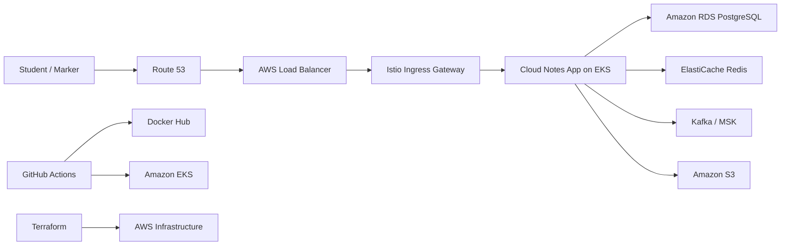

# Cloud Notes App

Cloud Notes App is a cloud-native notes service designed to match the main requirements from a typical "Developing for the Cloud" assignment. The project includes a Python Flask API, PostgreSQL support for AWS RDS, Redis caching, optional Kafka event publishing, Docker containerisation, Kubernetes and Istio manifests for AWS EKS, Terraform infrastructure, and a GitHub Actions CI/CD pipeline.

## Assignment 2 Deliverables

- Functional cloud-based application developed from the Assignment 1 case study
- Public GitHub repository with complete source code and deployment assets
- Clear setup instructions, technology stack summary, and cloud deployment guidance
- Technical report with the public GitHub repository link placed at the beginning
- Clean repository content with no personal identifiers in code, comments, or documentation

## Assignment Alignment

- Local application: Python Flask REST API
- AWS RDS integration: PostgreSQL via `DATABASE_URL`
- Docker: `Dockerfile` and `docker-compose.yml`
- Docker Hub ready: GitHub Actions builds and pushes images
- AWS EKS deployment: manifests in `k8s/`
- Istio sidecar and ingress: namespace injection, Gateway, VirtualService, DestinationRule
- Internet-facing load balancer: `k8s/istio/istio-ingressgateway-service.yaml`
- Route 53 ready: optional Terraform record
- CI/CD pipeline: `.github/workflows/ci-cd.yml`
- Infrastructure as Code: `terraform/`
- Redis: enabled for note caching
- Kafka: optional note event publishing via `KAFKA_BOOTSTRAP_SERVERS`

## Technology Stack

- Backend API: Python, Flask, Gunicorn
- Database: SQLite for local development, PostgreSQL for AWS RDS
- Cache: Redis
- Messaging: Kafka
- Object storage: Amazon S3
- Containers: Docker, Docker Compose
- Container orchestration: Kubernetes on AWS EKS
- Service mesh: Istio
- Infrastructure as Code: Terraform
- CI/CD: GitHub Actions
- Testing: Pytest

## Repository Structure

```text
cloud-notes-app/
├── .github/workflows/ci-cd.yml
├── app/
│   ├── config.py
│   ├── models/db.py
│   ├── routes/
│   │   ├── health.py
│   │   ├── notes.py
│   │   └── upload.py
│   └── services/
│       ├── cache_service.py
│       ├── event_service.py
│       ├── notes_service.py
│       └── s3_service.py
├── docs/
│   ├── architecture.md
│   ├── submission-checklist.md
│   └── video/
├── k8s/
│   ├── base/
│   └── istio/
├── scripts/
├── terraform/
├── tests/
├── docker-compose.yml
├── Dockerfile
├── main.py
└── requirements.txt
```

## Features

- CRUD API for notes
- PostgreSQL-compatible database layer for AWS RDS
- Redis cache support for note list and note detail endpoints
- Kafka event publishing for note lifecycle events
- S3 upload endpoint for file uploads
- Health endpoints for Kubernetes liveness and readiness probes
- Production-ready container image with Gunicorn

## Architecture

See [docs/architecture.md](docs/architecture.md) for the diagram.



## API Endpoints

- `GET /`
- `GET /health/live`
- `GET /health/ready`
- `GET /notes`
- `GET /notes/<id>`
- `POST /notes`
- `PUT /notes/<id>`
- `DELETE /notes/<id>`
- `POST /upload`

## Local Development

### 1. Create a virtual environment

```bash
python3 -m venv .venv
source .venv/bin/activate
pip install -r requirements.txt
cp .env.example .env
```

### 2. Run locally with SQLite only

Keep `DATABASE_URL` pointing to SQLite and start the API:

```bash
python main.py
```

### 3. Run with PostgreSQL, Redis, and Kafka using Docker Compose

```bash
docker compose up --build
```

The application will be available at [http://localhost:5000](http://localhost:5000).

## Environment Variables

```env
PORT=5000
FLASK_DEBUG=true
ENVIRONMENT=development
DATABASE_URL=sqlite:///data/notes.db
CACHE_TTL_SECONDS=60
REDIS_URL=redis://localhost:6379/0
KAFKA_BOOTSTRAP_SERVERS=localhost:9092
KAFKA_TOPIC=cloud-notes.events

AWS_ACCESS_KEY_ID=your_access_key
AWS_SECRET_ACCESS_KEY=your_secret_key
AWS_REGION=ap-southeast-1
AWS_BUCKET_NAME=your_bucket_name
S3_ENDPOINT_URL=
S3_PUBLIC_BASE_URL=
```

## Quick API Test

Create a note:

```bash
curl -X POST http://localhost:5000/notes \
  -H "Content-Type: application/json" \
  -d '{"title":"Assignment 2","content":"Cloud-native note"}'
```

List notes:

```bash
curl http://localhost:5000/notes
```

Upload a file to S3:

```bash
curl -X POST http://localhost:5000/upload -F "file=@/path/to/file.txt"
```

## Docker

Build manually:

```bash
docker build -t your-dockerhub-username/cloud-notes-app:latest .
```

Push manually:

```bash
docker push your-dockerhub-username/cloud-notes-app:latest
```

## Cloud Deployment Guidance

This repository is structured so you can move from local development to AWS deployment in stages:

1. Run the app locally with SQLite to verify the API and UI behavior.
2. Run `docker compose up --build` to validate the containerised stack with PostgreSQL, Redis, and Kafka.
3. Provision AWS infrastructure from `terraform/` for EKS, RDS, Redis, and optional Route 53.
4. Install Istio and apply the manifests in `k8s/` to deploy the application into EKS.
5. Configure GitHub Actions secrets so image build, push, and EKS deployment can run automatically.
6. Record a working demo video after the AWS deployment is live and stable.

## Kubernetes and Istio on AWS EKS

### 1. Provision AWS infrastructure with Terraform

```bash
cd terraform
cp terraform.tfvars.example terraform.tfvars
terraform init
terraform plan
terraform apply
```

### 2. Configure kubectl for EKS

```bash
aws eks update-kubeconfig --region ap-southeast-1 --name cloud-notes-eks
```

### 3. Install Istio

```bash
chmod +x scripts/install-istio.sh
./scripts/install-istio.sh
```

### 4. Create the Kubernetes secret from real AWS values

Do not commit real secrets. Either:

- use `k8s/base/secret.template.yaml` as a local template only, or
- create the secret from command line with `kubectl create secret generic`

### 5. Deploy the app

```bash
chmod +x scripts/apply-k8s.sh
./scripts/apply-k8s.sh
```

### 6. Point Route 53 to the Istio load balancer

After the ingress service gets a public DNS name, update `terraform.tfvars` with:

- `route53_zone_id`
- `route53_record_name`
- `load_balancer_dns_name`
- `load_balancer_zone_id`

Then run:

```bash
terraform apply
```

## CI/CD Pipeline

The GitHub Actions workflow does the following:

1. Installs dependencies and runs tests.
2. Compiles Python files.
3. Validates Terraform.
4. Builds and pushes a Docker image to Docker Hub.
5. Deploys the latest image to AWS EKS.

### Required GitHub Secrets

- `DOCKERHUB_USERNAME`
- `DOCKERHUB_TOKEN`
- `AWS_ACCESS_KEY_ID`
- `AWS_SECRET_ACCESS_KEY`
- `AWS_REGION`
- `EKS_CLUSTER_NAME`
- `DATABASE_URL`
- `REDIS_URL`
- `KAFKA_BOOTSTRAP_SERVERS`
- `APP_AWS_ACCESS_KEY_ID`
- `APP_AWS_SECRET_ACCESS_KEY`
- `AWS_BUCKET_NAME`
- `S3_ENDPOINT_URL`
- `S3_PUBLIC_BASE_URL`

## Submission Checklist

Before submitting, review [docs/submission-checklist.md](docs/submission-checklist.md).

Important manual requirement:

- Put your final demo video file directly inside `docs/video/`
- Keep the repository public
- Keep the source code, Docker, YAML, Terraform, README, and workflow files complete
- Put the GitHub repository link at the beginning of your technical report
- Keep your commit history authentic and meaningful
- Remove personal identifiers before submission

## Technical Report Support

Use [technical-report-outline.md](docs/technical-report-outline.md) as a starting point for your report structure. It already includes a placeholder for the public GitHub link at the top.

## Automated Tests

Run the local test suite with:

```bash
pytest
```
