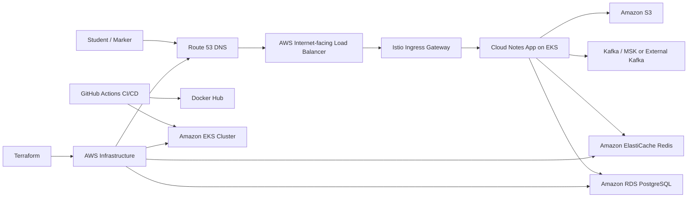

# Cloud Notes App Architecture

```mermaid
flowchart LR
    User["Student / Marker"] --> DNS["Route 53 DNS"]
    DNS --> LB["AWS Internet-facing Load Balancer"]
    LB --> IGW["Istio Ingress Gateway"]
    IGW --> APP["Cloud Notes App on EKS"]
    APP --> RDS["Amazon RDS PostgreSQL"]
    APP --> REDIS["Amazon ElastiCache Redis"]
    APP --> KAFKA["Kafka / MSK or External Kafka"]
    APP --> S3["Amazon S3"]
    CI["GitHub Actions CI/CD"] --> REG["Docker Hub"]
    CI --> EKS["Amazon EKS Cluster"]
    TF["Terraform"] --> AWS["AWS Infrastructure"]
    AWS --> EKS
    AWS --> RDS
    AWS --> REDIS
    AWS --> DNS
```
