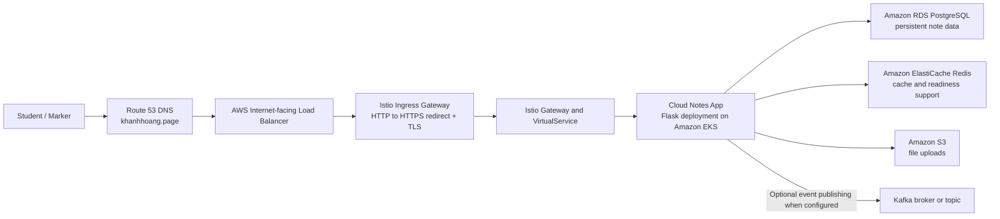
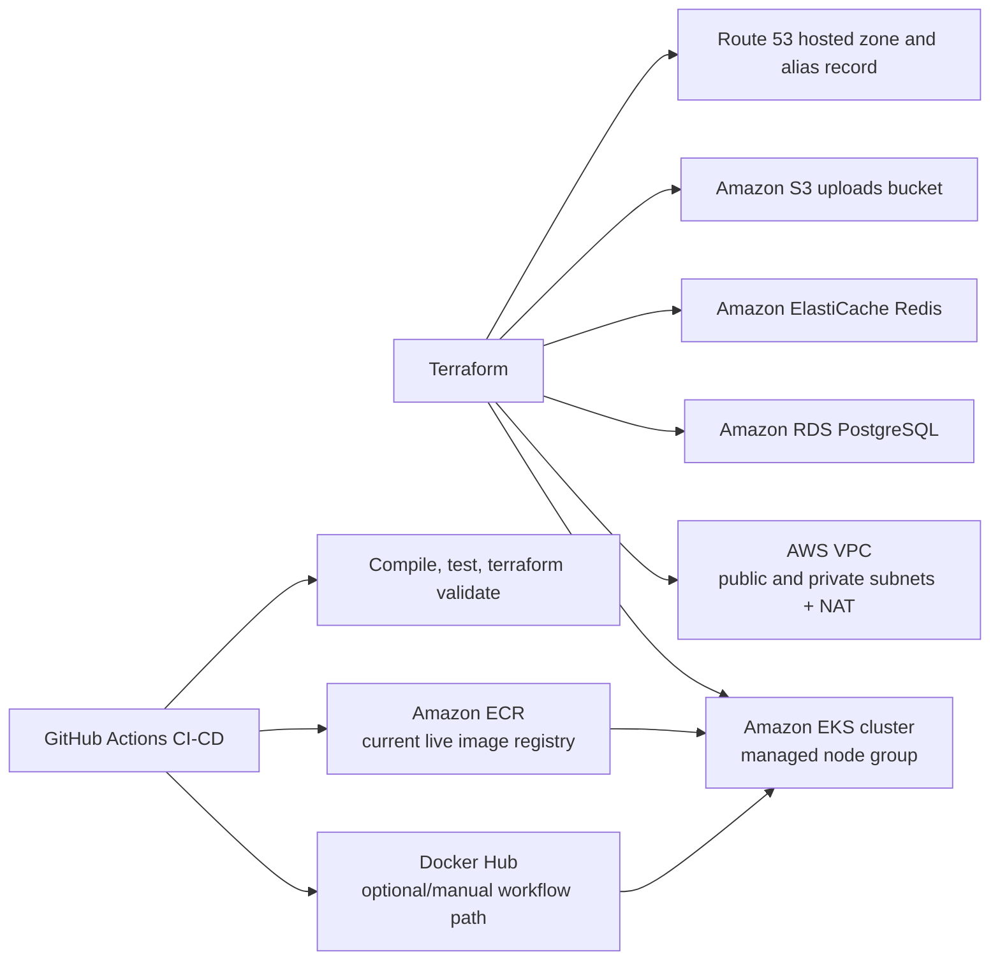
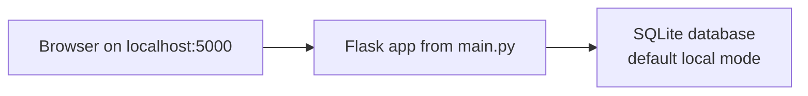
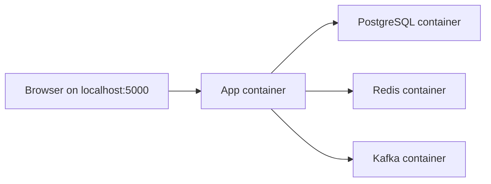

# Cloud Notes App Architecture

This document reflects the project as it currently exists in the repository and in the live AWS deployment.

## Production Architecture

## Infrastructure Provisioning and Delivery

## Local Development Views

### Quick Local Run

### Docker Compose Development Stack

## Architecture Notes

- The live public domain is `https://khanhhoang.page`.
- The live production deployment currently uses Amazon ECR for the running application image.
- Docker Hub is still represented in the repository because the deployment workflow supports that path, but the current live environment is running from ECR.
- Kafka exists in the codebase and local Docker Compose stack. In the application code it is optional and only publishes events when `KAFKA_BOOTSTRAP_SERVERS` is configured.
- Redis and database connectivity are part of the readiness checks, so they are not just diagram components; they are used directly by the running service.
- Istio is implemented through the ingress gateway, Gateway, VirtualService, and DestinationRule manifests in `k8s/`.
